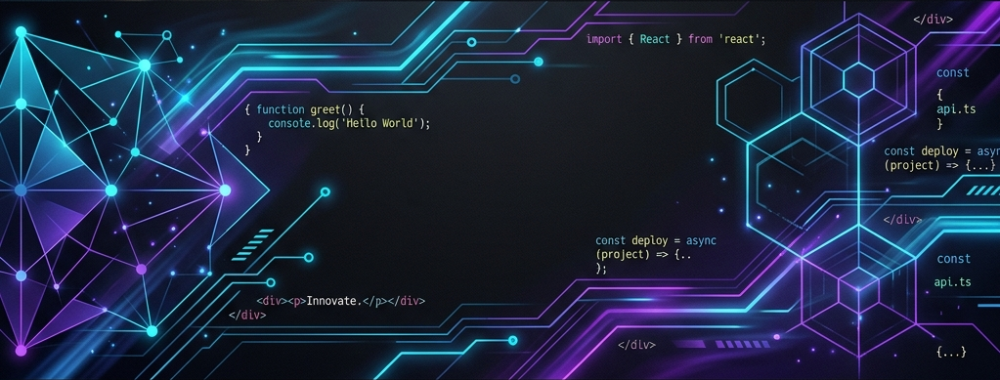

<h1 align="center">👨‍💻 Salut, je suis Jonathan Araldi (Skies-Land)</h1>

  

<h3 align="center"><em>"Concevoir des interfaces, dynamiques et performantes."</em></h3>

  Ayant récemment terminé ma formation de <b>Concepteur Développeur d'Applications Web</b> chez <a href="https://www.studi.com/fr" target="_blank"><b>STUDI</b></a> <i>(faisant suite à un parcours <b>d'Intégrateur Web</b> chez OpenClassrooms)</i>, j'ai consolidé les compétences acquises lors de ces deux formations pour élaborer un portfolio centralisant mes projets.

  

---

## 🚀 À propos de moi

- 🔭 Je travaille actuellement sur le développement d'une application de facturation.
- 🌱 J'approfondis mes connaissances et mes compétences techniques sur **React**, **TypeScript** et prochainement **Python**.
- 💡 De l'idée au déploiement, je structure mes projets via une phase de **conception** complète *(brainstorming, maquettes, choix techniques, user stories, schémas)*. En phase de développement actif, j'intègre le **pair programming avec l'IA** et m'appuie sur des architectures modernes *(Serverless via **Firebase**, bases de données avec **MongoDB**)*.
- 🎯 **Mon objectif** : avoir le plaisir de contribuer à des projets innovants, stimulants et formateurs tout en développant constamment mes compétences techniques.

---

## 🛠️ Ma stack technique

### Frontend

  
  
  
  
  
  

### Backend & BaaS

  
  
  
  

### Outils & Environnement

  
  
  
  
  
  

---

## 📊 Statistiques GitHub

  
  

---

## 🗺️ Ma roadmap développeur

Être développeur, c'est un apprentissage continu. Voici mon plan de route pour les mois et années à venir :

- [x] **Fondations solides** : Validation de mes compétences en Intégration et Conception Web.
- [x] **Mise en pratique** : Élaboration de mon **[Portfolio](https://portfolio-jonathan-araldi.netlify.app/)** et centralisation de mes projets.
- [ ] 🏃‍♂️ **Court terme** : Rejoindre une équipe stimulante pour contribuer à des projets concrets et parfaire mes bonnes pratiques de développement.
- [ ] 🧗‍♂️ **Moyen terme** : Atteindre un niveau d'expertise poussé sur le Front-end, notamment sur les architectures complexes (React / TypeScript).
- [ ] 🚀 **Long terme** : Évoluer vers une maîtrise Full-Stack complète, me permettant de concevoir et de porter des applications web de A à Z.
